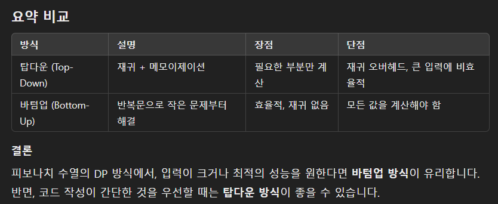

# 피보나치 DP 예제
피보나치 수열 점화식
- F(n)=F(n−1)+F(n−2)
## 탑 다운 : 메모이제이션 활용(Memoization)
- 이미 계산된 값은 저장해 두어 중복 계산을 피한다. 
- 피보나치 수열에서는 `dp={}` 딕셔너리를 활용한다. 
- 탑다운 방식은 재귀를 통해 문제를 풀어내기 때문에 계산이 필요한 경우에만 수행됩니다. 하지만 재귀 호출의 오버헤드가 발생할 수 있으므로 호출이 많은 경우에는 비효율적일 수 있습니다.
```python
import sys
n = sys.stdin.readline()
dp={}

def fibo(n):
    if n==0:
        return 0
    if n==1:
        return 1
    
    if n in dp:
        return dp[n]

    dp[n] = fibo(n-1)+fibo(n-2)
    return dp[n]
    
print(fibo(int(n)))
```

## 바텀업(Bottom-Up) 방식
- 반복문을 사용해 작은 부분 문제부터 차례로 해결하며, 점진적으로 큰 문제를 해결하는 방식
- 메모이제이션 없이도 구현할 수 있으며, 공간과 시간 면에서 탑다운보다 더 효율적일수 있다.

```python
def fibo(n):
    if n==0:
        return 0
    if n==1:
        return 1
    
    dp = [0] * (n+1)
    dp[0], dp[1] = 0, 1

    for i in range(2,n+1):
        dp[i] = dp[i-1]+dp[i-2] # dp 점화식
        
    return dp[n]

print(fibo(int(5)))
```

