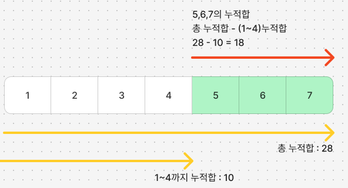

# 부분 배열 합=누적합[j]−누적합[i−1]

## 누적합[i−1]=누적합[j]−k(부분 배열의 합)

2. dic[0] = 1의 의미

dic는 누적합 값을 키로 하고, 그 값이 몇 번 나왔는지를 세는 딕셔너리예요.
dic[0] = 1은 누적합이 0인 경우가 1번 발생했다는 의미예요. 즉, 처음 시작할 때의 상태를 나타내요.

초기 상태 설정:

알고리즘이 시작될 때, runningSum이 0으로 초기화됩니다.
dic[0] = 1은 이 상태를 반영하여, 누적합이 0인 부분 배열의 수를 세는 데 도움이 됩니다.