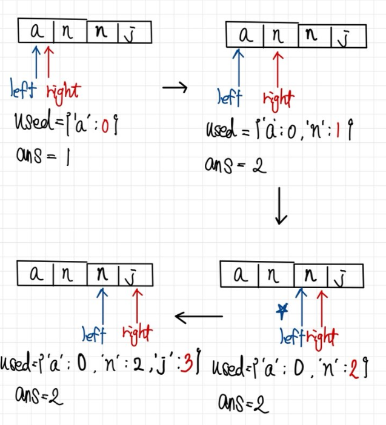

```python
class Solution:
    def lengthOfLongestSubstring(self, s: str) -> int:
        used = {}
        max_len = 0
        left = 0

        for right,st in enumerate(s):
            if st in used and left <= used[st]:
                left = used[st]+1
            else:
                max_len = max(max_len,right-left+1)
            used[st]=right
    
       
        return max_len
```
