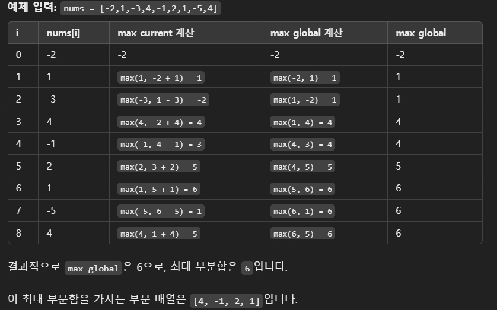

카데인 알고리즘(Kadane’s Algorithm)은 배열 내 연속된 부분 배열(subarray) 중에서 최대 합을 찾는 알고리즘입니다. 이 알고리즘의 핵심 아이디어는 각 위치에서 가능한 최대 부분합을 동적으로 갱신하며, 배열을 한 번만 순회해서 해결하는 것입니다. 이는 **O(n)**의 시간 복잡도를 가지므로 매우 효율적입니다.

1. 카데인 알고리즘의 동작 원리
카데인 알고리즘은 각 위치에서의 최대 부분합을 두 가지 값 중 큰 값으로 갱신하는 방식으로 동작합니다:

현재 요소 자체 값: 현재 요소 nums[i]만을 선택하는 경우.
현재 요소 + 이전까지의 최대 부분합: 현재 요소를 포함하면서 연속된 부분 배열을 확장하는 경우, 즉, max_current + nums[i].
이 두 값 중 더 큰 값을 선택하여 현재 위치까지의 최대 부분합을 구합니다. 또한, 이 최대 부분합을 전체 최대 부분합(max_global)과 비교하여 전체 최대 부분합을 갱신해 나갑니다.

2. 구현 단계
변수 초기화: 첫 번째 요소를 기준으로 max_current와 max_global을 초기화합니다.

max_current: 현재 위치까지의 최대 부분합.
max_global: 지금까지 확인한 부분합 중 최대 값.
반복문을 통해 배열 순회:

각 요소에서 max_current를 갱신: max_current = max(nums[i], max_current + nums[i])
nums[i] 자체를 선택할지, 또는 max_current + nums[i]로 현재 부분합을 확장할지 결정.
max_global 갱신: max_global = max(max_global, max_current)
max_global을 max_current와 비교하여 전체 최대 부분합을 갱신합니다.
결과 반환: max_global이 최종적으로 최대 부분합을 담고 있으므로 이를 반환합니다.

3. 카데인 알고리즘 코드 (파이썬)
```python
def maxSubArray(nums):
    max_current = max_global = nums[0]

    for i in range(1, len(nums)):
        max_current = max(nums[i], max_current + nums[i])
        max_global = max(max_global, max_current)
    
    return max_global
```

4. 예제와 동작 과정


5. 카데인 알고리즘의 장점
시간 효율성: 배열을 한 번만 순회하므로 시간 복잡도가 O(n)으로, 매우 큰 배열에서도 효율적입니다.
단순성: 동적 프로그래밍을 사용하여 배열의 각 요소에서 가능한 최대 값을 동적으로 구할 수 있어 코드가 간결합니다.
카데인 알고리즘은 연속된 부분 배열의 합 문제를 해결할 때 매우 유용하며, 다양한 변형 문제에도 응용될 수 있습니다.